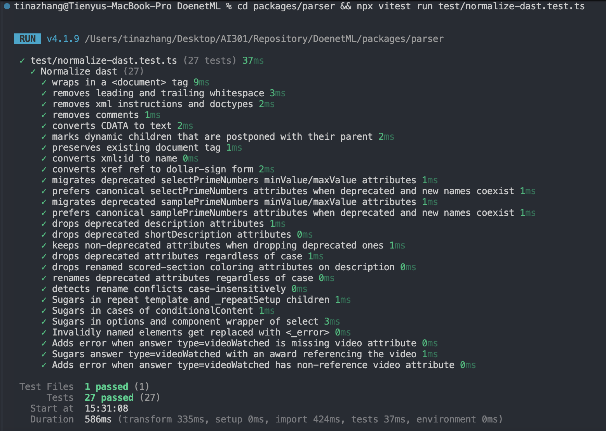
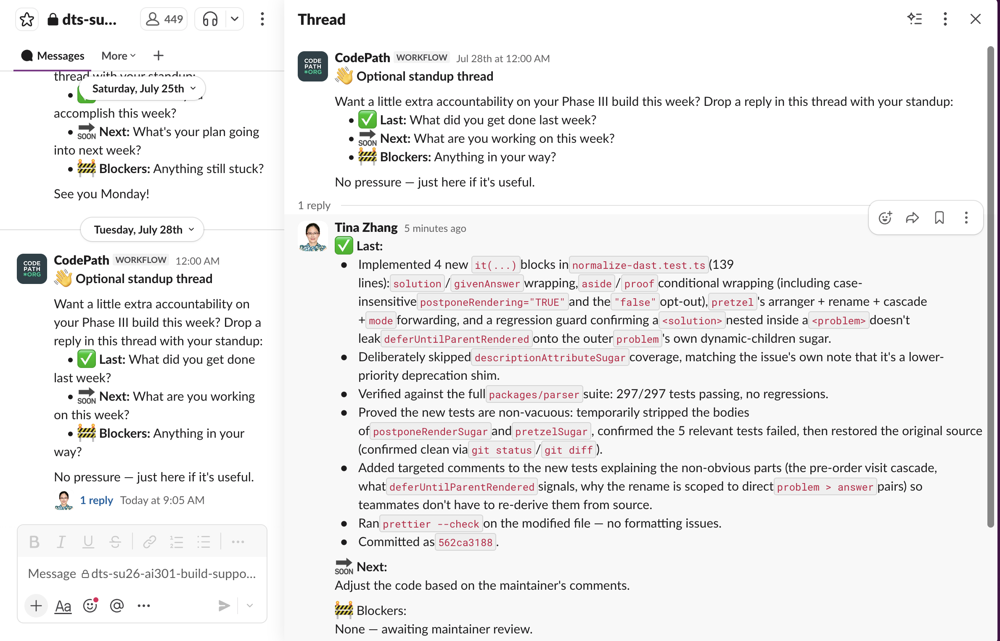
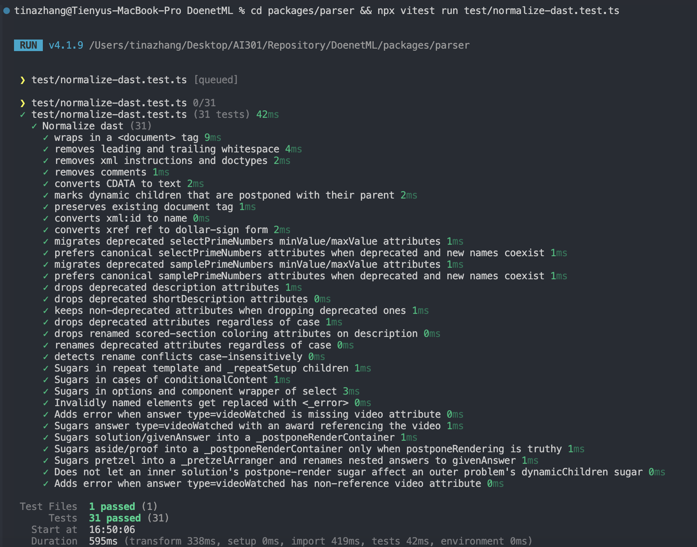

# Contribution: Add test coverage for new sugar added

**Contribution Number:** 1  

**Student:** Tienyu Zhang 

**Issue:** https://github.com/Doenet/DoenetML/issues/802

**Status:** Phase IV Complete - PR Merged

---

## Why I Chose This Issue
DoenetML is an NSF-funded open-source markup language powering interactive math education at scale. This issue is a well-scoped testing task in a TypeScript parser package — directly aligned with my background in software testing (multi-threaded TCP server, AWS CloudWatch component isolation) and my interest in education technology. It lets me make a meaningful contribution to a real academic platform while learning a modern TypeScript/parser testing codebase from the ground up.

---

## Understanding the Issue

### Problem Description
The DAST normalization module (packages/parser/src/dast-normalize/normalize-dast.ts) implements "sugar" — shorthand syntax transformations that convert simplified DoenetML markup into their full canonical DAST (DoenetML Abstract Syntax Tree) form. However, the corresponding test file (packages/parser/test/normalize-dast.test.ts) is missing test cases for three of these sugar transformations: solution/givenAnswer, aside/proof, and pretzel. This means the sugar logic for these components is unverified by automated tests.

### Expected Behavior
For each of the three sugar-enabled component pairs/groups, there should be test cases in normalize-dast.test.ts that verify: (1) the sugar input (shorthand markup) is correctly transformed into the expected full canonical DAST output by the normalizer, and (2) the transformation handles relevant edge cases (e.g. with and without children, with attributes, nested content). Tests should pass in CI on every future PR, protecting these transformations from regressions.

### Current Behavior
No tests exist for the solution/givenAnswer, aside/proof, and pretzel sugar transformations. If a future change accidentally breaks the normalization logic for these components, CI would not catch it — the regression would only surface at runtime in the rendered DoenetML output.

### Affected Components
packages/parser/src/dast-normalize/normalize-dast.ts — contains the sugar transformation logic being tested (read-only reference; no changes needed here)
packages/parser/test/normalize-dast.test.ts — the test file where new test cases for solution/givenAnswer, aside/proof, and pretzel sugar must be added
DoenetML components: `solution`, `givenAnswer`, `aside`, `proof`, and `pretzel` — the markup elements whose normalization sugar is currently untested

---

## Reproduction Process

### Environment Setup

1. Forked [Doenet/DoenetML](https://github.com/Doenet/DoenetML) to my own GitHub account: [TienyuZhang/DoenetML](https://github.com/TienyuZhang/DoenetML).
2. Cloned my fork locally with `git clone`.
3. Confirmed my fork's `main` was up to date with `Doenet/DoenetML:main` before starting work.
4. Created a dedicated feature branch, `add_test_coverage_for_new_sugar_added`, off `main` to isolate this contribution.

### Steps to Reproduce

Since this issue is a missing-test-coverage gap rather than a runtime bug, "reproducing" it means confirming the gap actually exists in the code:

1. Opened `packages/parser/src/dast-normalize/normalize-dast.ts` and located the sugar transformation logic for the `solution`/`givenAnswer`, `aside`/`proof`, and `pretzel` component pairs/groups.
2. Opened `packages/parser/test/normalize-dast.test.ts` and searched for existing test cases referencing these components.
3. **Observed result:** no test cases exist for any of the three sugar transformations, confirming the gap described in the issue — the sugar logic runs unverified by CI.

### Reproduction Evidence

- **Commit showing reproduction:** No commits pushed to `add_test_coverage_for_new_sugar_added` yet. Since this is a coverage gap (not a bug with a reproducible failure), "reproduction" is the confirmation above rather than a runnable repro commit.
- **Screenshots/logs:** Grep output over `normalize-dast.test.ts` showing zero matches for `solution`, `givenAnswer`, `aside`, `proof`, and `pretzel`.

  

  Running the full existing suite (`npx vitest run test/normalize-dast.test.ts`) confirms all 27 current tests pass, and none of their names reference `solution`, `givenAnswer`, `proof`, or `pretzel` — the baseline this contribution adds coverage on top of.
- **My findings:** The sugar transformation logic for all three component pairs/groups is implemented in `normalize-dast.ts`, but `normalize-dast.test.ts` has no corresponding test cases — matching the issue description exactly and confirming there is real work to do here, not just a documentation gap.

---

## Solution Approach

### Analysis

This is a coverage gap, not a logic bug — the sugar itself is implemented and already wired up in `pluginComponentSugar`'s switch statement in `normalize-dast.ts`:

- **`solution` / `givenAnswer`** (lines 200–203): unconditionally call `postponeRenderSugar(node)`. That function (`component-sugar/postponeRender.ts`) pulls out any `<title>` children, wraps everything else in a `<_postponeRenderContainer>`, and asserts it is only ever called on `solution`/`givenAnswer`/`aside`/`proof`.
- **`aside` / `proof`** (lines 204–220): call the *same* `postponeRenderSugar`, but only when a `postponeRendering` attribute is present **and** truthy — truthy meaning the attribute has no children (bare `postponeRendering`) or a single text child equal to `"true"` case-insensitively. Any other value (e.g. `postponeRendering="false"`) leaves the node untouched.
- **`pretzel`** (lines 221–223): calls `pretzelSugar(node)` (`component-sugar/pretzel.ts`), which (1) renames any `<answer>` that is a direct child of a direct `<problem>` child to `<givenAnswer>`, (2) wraps all children in a single `<_pretzelArranger>`, and (3) forwards the `mode` attribute onto that arranger if present.

Searching `normalize-dast.test.ts` confirms the gap: there is no test that calls `normalizeDocumentDast` on `<solution>`, `<givenAnswer>`, `<proof>`, or `<pretzel>` and asserts on the resulting shape, and no test asserts the `_postponeRenderContainer`/`_pretzelArranger` wrapping directly. The one adjacent test, `"marks dynamic children that are postponed with their parent"` (lines 90–120), uses `<aside postponeRendering>` but only asserts the *downstream* `deferUntilParentRendered` attribute on `_dynamicChildren` — it never asserts the `postponeRenderSugar` output itself, and it doesn't touch `proof`, `solution`, `givenAnswer`, or `pretzel` at all. So the conditional branch and the two other sugars are completely unverified.

### Proposed Solution

Add new `it(...)` blocks to `packages/parser/test/normalize-dast.test.ts`, following the file's existing convention (`lezerToDast` → `normalizeDocumentDast` → `toXml`, asserted against a literal expected XML string, as in `"Sugars in repeat template..."` and `"Sugars in cases of conditionalContent"`):

1. **solution/givenAnswer** — assert both tags always wrap their non-`<title>` children in `<_postponeRenderContainer>`, and that a leading `<title>` is hoisted out of the container.
2. **aside/proof** — assert the conditional branch directly: no `postponeRendering` attribute → untouched; bare `postponeRendering` or `postponeRendering="true"`/`"TRUE"` → wrapped; `postponeRendering="false"` → untouched.
3. **pretzel** — assert children are wrapped in `<_pretzelArranger>`; that a direct `<answer>` inside a direct `<problem>` child is renamed to `<givenAnswer>` (while an `<answer>` *not* nested in a `<problem>` is left alone); and that a `mode` attribute is forwarded onto the arranger only when present.

### Implementation Plan

Using UMPIRE framework (adapted):

**Understand:** `normalize-dast.test.ts` has no coverage for the `solution`/`givenAnswer`, `aside`/`proof`, and `pretzel` sugar branches in `pluginComponentSugar`, even though the transformation logic for all three exists and is exercised in production. The fix is test-only — add cases that pin down current, correct behavior so regressions are caught in CI.

**Match:** The file already has a clear pattern for exactly this kind of test — see `"Sugars in repeat template and _repeatSetup children"` and `"Sugars in cases of conditionalContent"` — each `it()` builds several `source` strings, runs them through `lezerToDast` + `normalizeDocumentDast`, and compares `toXml(...)` output against a literal expected string. New tests should reuse this style rather than introducing a new assertion pattern.

**Plan:**
1. Add `it("Sugars solution/givenAnswer into a _postponeRenderContainer", ...)` — cases with content only, and with a leading `<title>` plus content, for both `<solution>` and `<givenAnswer>`.
2. Add `it("Sugars aside/proof into a _postponeRenderContainer only when postponeRendering is truthy", ...)` — cases: no attribute (unchanged), bare `postponeRendering` (wrapped), `postponeRendering="true"`/mixed-case (wrapped), `postponeRendering="false"` (unchanged) — for both `<aside>` and `<proof>`.
3. Add `it("Sugars pretzel into a _pretzelArranger and renames nested answers to givenAnswer", ...)` — cases: plain `<problem><answer/></problem>` inside `<pretzel>` (renamed + wrapped), a bare `<answer>` not inside `<problem>` (left as `<answer>`), and a `mode` attribute (forwarded onto `_pretzelArranger`) vs. no `mode` (arranger has no `mode` attribute).
4. Run the parser package's test suite locally (`vitest`/`npm test` in `packages/parser`) to confirm new tests pass and nothing existing regresses.
5. Run lint/typecheck if configured for the package, since this is a TypeScript codebase with CI checks.

**Implement:** Work happens on my fork's `add_test_coverage_for_new_sugar_added` branch: https://github.com/TienyuZhang/DoenetML/tree/add_test_coverage_for_new_sugar_added (commits to be linked here as they land).

**Review:** Before opening the PR — confirm tests follow the existing file's style and naming, confirm no non-test files were touched (issue is test-only), confirm commit messages are descriptive, and check DoenetML's `CONTRIBUTING` guidelines for PR conventions.

**Evaluate:** Run the full `packages/parser` test suite (not just this file) to check for regressions, and manually delete a line from `postponeRenderSugar`/`pretzelSugar` locally to confirm the new tests actually fail without the logic — proving they test the real behavior rather than passing vacuously.

---

## Testing Strategy

### Unit Tests

Each case below asserts on `toXml(normalizeDocumentDast(dast))` for a single sugar in isolation, following the existing file's convention:

- [ ] `<solution>` with plain content (no `<title>`) → all children wrapped in a single `<_postponeRenderContainer>`.
- [ ] `<solution>` with a leading `<title>` plus content → `<title>` hoisted out, remaining children wrapped in `<_postponeRenderContainer>`.
- [ ] `<givenAnswer>` → same two cases as `<solution>` (same code path, `postponeRenderSugar` is unconditional for both).
- [ ] `<aside>` with **no** `postponeRendering` attribute → children left untouched (no `_postponeRenderContainer`).
- [ ] `<aside postponeRendering>` (bare attribute, no value) → children wrapped in `<_postponeRenderContainer>`.
- [ ] `<aside postponeRendering="true">` and `<aside postponeRendering="TRUE">` (case-insensitive) → wrapped.
- [ ] `<aside postponeRendering="false">` → untouched.
- [ ] `<proof>` → same four cases as `<aside>` (identical branch, currently has zero coverage of any kind).
- [ ] `<pretzel>` with plain content → all children wrapped in a single `<_pretzelArranger>`.
- [ ] `<pretzel mode="...">` → `mode` attribute forwarded onto `<_pretzelArranger>`; `<pretzel>` with no `mode` → arranger has no `mode` attribute.
- [ ] `<pretzel><problem><answer/></problem></pretzel>` → the `<answer>` is renamed to `<givenAnswer>`.
- [ ] `<pretzel><answer/></pretzel>` (an `<answer>` **not** nested in a `<problem>`) → left as `<answer>`, confirming the rename is scoped to direct `<problem>` children only.

### Integration Tests

These verify how the new sugars compose with the rest of the normalization pipeline — the kind of interaction a purely isolated unit test would miss:

- [ ] **Pretzel → postponeRender cascade:** `visit()` (in `utils/visit.ts`) is pre-order and walks into a node's *mutated* children after its `enter` callback runs, so the `<givenAnswer>` produced by `pretzelSugar`'s rename is itself re-dispatched through `pluginComponentSugar`'s switch statement in the same tree walk. Confirm `<pretzel><problem><answer/></problem></pretzel>` ends with the renamed `<givenAnswer>` **also** wrapped in its own `<_postponeRenderContainer>` — i.e. the two sugars compose, rather than the renamed node silently skipping the `solution`/`givenAnswer` branch.
- [ ] **Aside/proof + dynamicChildren sugar:** extend the existing `"marks dynamic children that are postponed with their parent"` test (currently `<aside>`-only) to `<proof>`, confirming `deferUntilParentRendered` is set on `<_dynamicChildren>` when `postponeRendering` is truthy and absent otherwise, for both tags.
- [ ] **Nested sectioning component:** a `<problem>` (which supports dynamic children) containing a `<solution>` (which always gets `_postponeRenderContainer`) — confirm the outer `<problem>`'s own `_dynamicChildren` sugar is unaffected by the inner `<solution>`'s unconditional postpone-render wrapping.

### Manual Testing

Not yet performed — planned once the unit/integration tests above are written:

- [ ] Run the full `packages/parser` test suite locally (not just `normalize-dast.test.ts`) to confirm the new tests pass and nothing pre-existing regresses.
- [ ] Sanity-check that the new tests are non-vacuous: temporarily comment out the body of `postponeRenderSugar` and `pretzelSugar` locally and confirm the corresponding new tests fail, then revert.
- [ ] Author a small `.doenet` snippet using `<solution>`, `<aside postponeRendering>`, `<proof>`, and `<pretzel>` together and visually inspect the resulting DAST/XML to confirm it matches what the automated tests assert.

---

## Implementation Notes

### Week 7 Progress

Planning phase, before any test code was written:

- Read issue #802 and confirmed the gap was test-only: `pluginComponentSugar` in `normalize-dast.ts` already implements sugar for `solution`/`givenAnswer`, `aside`/`proof`, and `pretzel`, but `normalize-dast.test.ts` had zero test cases exercising any of the three.
- Forked the repo, cloned locally, and created the `add_test_coverage_for_new_sugar_added` branch off an up-to-date `main`.
- Read through `postponeRenderSugar` (`component-sugar/postponeRender.ts`) and `pretzelSugar` (`component-sugar/pretzel.ts`) to understand the exact transformation logic and the conditional branch for `aside`/`proof` (only sugared when `postponeRendering` is truthy).
- Drafted the Understanding/Solution Approach/Testing Strategy sections above, listing the unit and integration cases needed, before writing any code.

### Week 8 Progress

Implementation phase:

- **Environment setup took longer than expected.** `npm ci` was needed first (`node_modules` was out of sync with the lockfile — missing `@lezer/lr`). After that, two more workspace packages turned out to need an explicit build before their `dist/` exports would resolve: `@doenet/static-assets` (for `entity-map`, used by the parser) and `@doenet/i18n` (needed by an unrelated test file, `coded-dast-errors.test.ts`, when running the full package suite). Fixed with `npm run build -w @doenet/static-assets` and `npm run build -w @doenet/i18n`.
- **Learned vitest must be run scoped to `packages/parser`**, not the repo root — the `.peggy` file loader plugin that the parser needs lives in `packages/parser/vite.config.ts` and isn't picked up when vitest runs from the root.
- Before writing any assertions, probed the real normalizer output for each case with disposable scratch test files (since printed values via `console.log` were swallowed by vitest, used `expect(...).toEqual("XXXX")` to force the actual value into the diff output) — this caught a couple of behaviors I hadn't predicted from just reading the source, most notably that the `<answer>`→`<givenAnswer>` rename inside `pretzelSugar` gets *re-visited* by the same tree walk and picks up `givenAnswer`'s own postpone-render sugar (an empty `<_postponeRenderContainer />`).
- Implemented 4 new `it(...)` blocks in `normalize-dast.test.ts` (139 lines): `solution`/`givenAnswer` wrapping, `aside`/`proof` conditional wrapping (including case-insensitive `postponeRendering="TRUE"` and the `"false"` opt-out), `pretzel`'s arranger + rename + cascade + `mode` forwarding, and a regression guard confirming a `<solution>` nested inside a `<problem>` doesn't leak `deferUntilParentRendered` onto the outer `problem`'s own dynamic-children sugar.
- Deliberately skipped `descriptionAttributeSugar` coverage, matching the issue's own note that it's a lower-priority deprecation shim.
- Verified against the full `packages/parser` suite: 297/297 tests passing, no regressions.
- Proved the new tests are non-vacuous: temporarily stripped the bodies of `postponeRenderSugar` and `pretzelSugar`, confirmed the 5 relevant tests failed, then restored the original source (confirmed clean via `git status`/`git diff`).
- Added targeted comments to the new tests explaining the non-obvious parts (the pre-order visit cascade, what `deferUntilParentRendered` signals, why the rename is scoped to direct `problem > answer` pairs) so teammates don't have to re-derive them from source.
- Ran `prettier --check` on the modified file — no formatting issues.
- Committed as `562ca3188`.

- **Screenshots/logs:** 
 

### Code Changes

- **Files modified:** `packages/parser/test/normalize-dast.test.ts` only — test-only change, no production code touched.
- **Key commits:** `562ca3188` "added test coverage for new sugar added" — https://github.com/Doenet/DoenetML/commit/562ca31884374cd8c9c5d30cb5b8557384bc58de
- **Approach decisions:**
  - Reused the file's existing `lezerToDast` → `normalizeDocumentDast` → `toXml` assertion pattern (as seen in `"Sugars in repeat template..."` and `"Sugars in cases of conditionalContent"`) rather than introducing a new assertion style.
  - Verified real (not assumed) sugar output via disposable scratch tests before writing final assertions, to avoid encoding incorrect expectations into the suite.
  - Scoped the implementation strictly to what the issue asked for (`solution`/`givenAnswer`, `aside`/`proof`, `pretzel`), plus one extra regression-guard test for a cross-sugar interaction (`problem` containing `solution`) that isn't explicitly named in the issue but was a real risk surfaced during analysis.

---

## Pull Request

**PR Link:** https://github.com/Doenet/DoenetML/pull/1596

**PR Description:**

### What does this PR do?

Adds test coverage in `packages/parser/test/normalize-dast.test.ts` for three DAST normalization sugar transformations that had none: `solution`/`givenAnswer` (unconditional postpone-render wrapping), `aside`/`proof` (postpone-render wrapping conditional on `postponeRendering`), and `pretzel` (arranger wrapping plus the `answer`→`givenAnswer` rename). This is a test-only change — no production code is modified.

### Why was this PR needed?

Issue #802 flagged that `pluginComponentSugar` in `normalize-dast.ts` already implements sugar for these three component groups, but `normalize-dast.test.ts` had no test cases exercising any of them — so a future regression in `postponeRenderSugar` or `pretzelSugar` would only surface at runtime instead of being caught in CI. Investigating confirmed the gap exactly as described: zero existing tests referenced `solution`, `givenAnswer`, `aside`, `proof`, or `pretzel`.

### What are the relevant issue numbers?

Issue #802

### Screenshots / Recordings

Test output for the affected file:



```
 Test Files  1 passed (1)
      Tests  31 passed (31)
```

Full `packages/parser` suite (no regressions):

```
 Test Files  13 passed (13)
      Tests  297 passed (297)
```

Confirmed the new tests are non-vacuous by temporarily stripping the bodies of `postponeRenderSugar`/`pretzelSugar` — all 5 relevant new tests failed as expected, then the source was restored unchanged.

### Does this PR meet the acceptance criteria?

- [x] Tests added for new/changed behavior
- [x] All tests passing
- [x] Follows project style guide (reuses the file's existing `lezerToDast` → `normalizeDocumentDast` → `toXml` assertion pattern; `prettier --check` clean)
- [x] No breaking changes introduced (test-only change)

**Maintainer Feedback:**
- [7/29/2026]: Maintainer approved the overall approach ("Thanks for the PR. It looks good!") and requested two small changes: (1) a comment on the pretzel test claimed pretzel uses `<_postponeRenderContainer>` to keep a problem's answer hidden until revealed, but that's incorrect — the container is added onto the renamed `<givenAnswer>` as a harmless side effect of the pre-order visit cascade, but pretzel itself never reads or strips it, so it has no actual hiding effect; (2) since the PR was written with AI assistance, add a `Co-Authored-By` trailer to the commit so future maintainers can see the code's origin.
- [7/29/2026]: Removed the incorrect parenthetical from the comment above the pretzel test in `normalize-dast.test.ts` (kept the accurate part: the arranger-wrapping and `answer`→`givenAnswer` rename), and committed the fix with `Co-Authored-By: Claude Sonnet 5 <noreply@anthropic.com>` appended to the commit message (`434b65bb2`, "Remove misleading comment about pretzel hiding answers").

**Status:** Merged

---

## Learnings & Reflections

### Technical Skills Gained

- **Monorepo build orchestration:** learned that in this npm-workspaces + Wireit setup, a package's tests can fail with confusing "cannot find package" errors simply because a *different* workspace package (`@doenet/static-assets`, `@doenet/i18n`) hasn't had its `dist/` built yet — the fix is `npm run build -w <package>`, not a dependency reinstall.
- **Vite/Vitest config scoping:** discovered that `packages/parser/vite.config.ts` registers a custom loader plugin for `.peggy` grammar files, and that plugin is only active when vitest is invoked from inside `packages/parser` — running from the repo root silently uses a different (or no) config and fails on import analysis.
- **Forcing hidden output out of a test runner:** when `console.log` output was swallowed by vitest, used `expect(actual).toEqual("literal-placeholder")` to make the runner print the real value in its failure diff — a quick way to inspect real behavior without adding logging infrastructure.
- **Reading a custom pre-order AST visitor:** worked through `utils/visit.ts` to confirm that mutating `node.children` inside an `enter` callback causes the *newly created* nodes to be walked and re-dispatched through the same sugar switch statement in the same pass — not an isolated one-shot transform.
- **Non-vacuous test verification:** temporarily gutting the implementation under test (`postponeRenderSugar`/`pretzelSugar`) and confirming the new tests fail is a cheap, concrete way to prove a test suite is actually exercising the logic it claims to, rather than trusting that assertions "look right."
- **More git commands, used with intent rather than by rote:** `git status`/`git diff --stat` to confirm a working tree is clean before and after a risky local experiment (gutting then restoring the sugar functions), `git log --oneline main..HEAD` to check exactly what a branch adds relative to `main`, and `git show <hash> --stat` to inspect what a specific commit actually touched.
- **The end-to-end open-source contribution workflow**, start to finish on a real project: fork → clone → confirm the fork's `main` is current → create an isolated feature branch → read the issue and the relevant source until the actual gap is understood (not just skimmed) → plan the fix and get it reviewed before writing code → implement → verify (targeted tests, then the full package suite, then a non-vacuousness check) → commit with a descriptive message → open a PR that references the issue (`Closes #802`) with evidence a reviewer can check without re-running anything themselves → await maintainer feedback.

### Challenges Overcome

- Hit three separate environment blockers in sequence before a single test could run: a stale `node_modules` missing `@lezer/lr` (fixed with `npm ci`), then two unbuilt workspace packages (`@doenet/static-assets`, `@doenet/i18n`) surfacing as unrelated-looking import errors, then the `.peggy`-loader/vitest-scoping issue. Each looked like a different kind of problem on the surface; tracing all three back to "environment/build state," not the test code, took some back-and-forth.
- The `pretzel` → `givenAnswer` → postpone-render cascade wasn't something I could confidently predict from reading `pretzelSugar` and `postponeRenderSugar` in isolation — the interaction only becomes obvious once you know the tree walk is pre-order and re-reads mutated children. Rather than guess and risk encoding a wrong assumption into the test suite, I verified the actual output with disposable scratch tests before writing the final assertions.
- I was unfamiliar with the whole process/workflow of contributing to an open-source project going in — fork vs. clone vs. branch, how a PR should reference an issue, what evidence a maintainer expects to see, how much process to document before touching code. This wasn't something I could resolve by reading `normalize-dast.ts` more carefully; it took actually going through the sequence once, end to end, on a real repo to internalize it.

### What I'd Do Differently Next Time

- Build all workspace-package dependencies up front (or run `npm run build:all`) before attempting to run any single package's tests, instead of discovering missing builds one error at a time.
- Do the "probe real output with scratch tests" step *before* finalizing the Testing Strategy section, so the written plan is grounded in verified behavior from the start rather than needing a second confirmation pass afterward.
- Note down the exact package-scoped test command (`cd packages/parser && npx vitest run <file>`) the first time it's needed, since it wasn't obvious upfront and cost a few iterations to land on.

---

## Resources Used

- This repo's own [AGENTS.md](AGENTS.md) — project conventions, monorepo structure, and build/test commands.
- Issue [#802](https://github.com/Doenet/DoenetML/issues/802) on Doenet/DoenetML.
- No external tutorials, docs, or Stack Overflow posts were needed — the work was entirely source-reading and empirical verification within this repo (`normalize-dast.ts`, `component-sugar/postponeRender.ts`, `component-sugar/pretzel.ts`, `component-sugar/dynamicChildren.ts`, `pretty-printer/normalize/utils/visit.ts`, and the existing conventions in `normalize-dast.test.ts`).